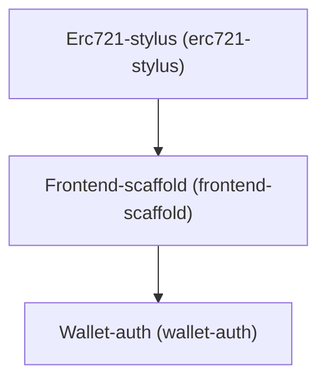

# Architecture

## Dependency Graph

```mermaid
graph TD
  d2826cca["Erc721-stylus (erc721-stylus)"]
  253ad594["Frontend-scaffold (frontend-scaffold)"]
  e9f5d128["Wallet-auth (wallet-auth)"]
  d2826cca --> 253ad594
  253ad594 --> e9f5d128
```

## Execution / Implementation Order

1. **Erc721-stylus** (`d2826cca`)
2. **Frontend-scaffold** (`253ad594`)
3. **Wallet-auth** (`e9f5d128`)
